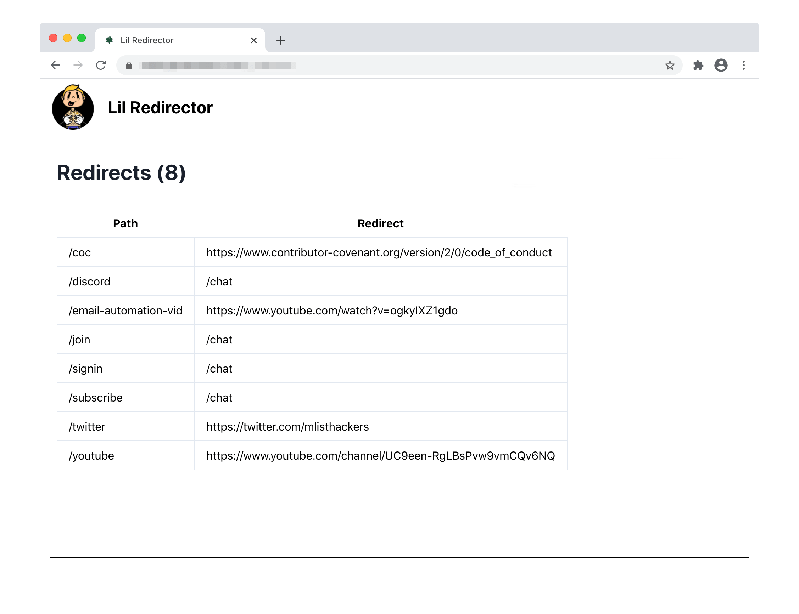
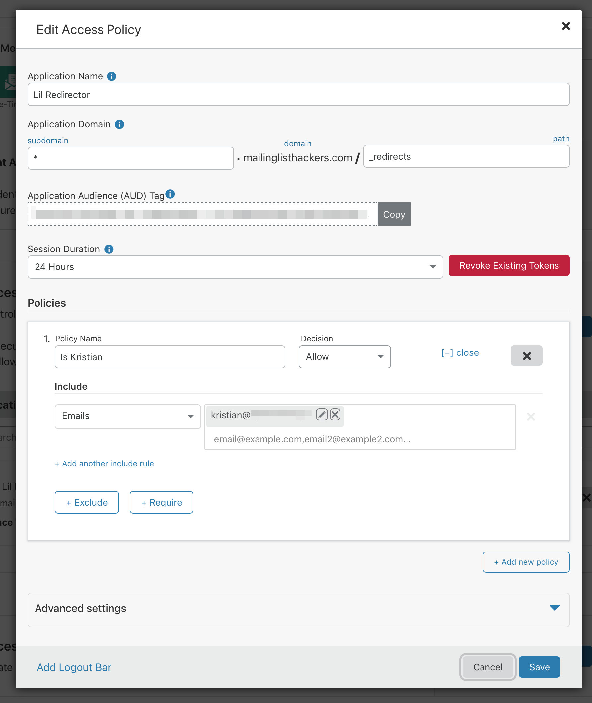

# lil redirector

a simple redirector engine for cloudflare workers.



## installation

1. install the package

```bash
$ npm install lilredirector
```

2. create a kv namespace called `REDIRECTS` using wrangler

```bash
$ wrangler kv:namespace create REDIRECTS
```

3. add the `kv-namespace` provided by wrangler output to `wrangler.toml`

```toml
kv_namespaces = [{ binding = "REDIRECTS", id = "$id", preview_id = "$id" }]
```

## usage

```javascript
import redirector from 'lilredirector'

addEventListener('fetch', event => event.respondWith(handler(event)))

// note the `event` function argument! many workers scripts will
// pass in `event.request`, lilredirector needs the full `event` object
async function handler(event) {
  const { response, error } = await redirector(event)
  if (response) return response

  // optionally return an error response
  if (error) return error

  // other workers code
}
```

## configuration

```javascript
import redirector from 'lilredirector'

addEventListener('fetch', event => event.respondWith(handler(event)))

async function handler(event) {
  const { response, error } = await redirector(event, {
    // configuration options can be passed as an optional object.
    // see the below documentation for examples of each:
    // cancelBulkAddOnError
    // removeTrailingSlashes
    // validateRedirects
  })
  // ...
}
```

### removing trailing slashes

by default, lilredirector will match and redirect URLs _without_ trailing slashes. for instance, if you have a redirect set up for `/about`, visiting `/about/` will search for a redirect for `/about` in the lilredirector database, and redirect accordingly. this feature can be disabled by passing the `removeTrailingSlashes` boolean in the configuration object into the `redirector` function:

```javascript
async function handler(event) {
  const { response, error } = await redirector(event, {
    removeTrailingSlashes: false,
  })
  if (response) return response
}
```

### validating redirects

by default, lilredirector will validate a redirect before allowing it to be saved. for instance, if you attempt to save a redirect for `/about` that points to `/foo`, a page that doesn't exist, lilredirector will error on save and return an error message in the UI. this can be disabled using the config option `validateRedirects`

```javascript
async function handler(event) {
  const { response, error } = await redirector(event, {
    validateRedirects: false,
  })
  if (response) return response
}
```

### canceling bulk adds on validation errors

as of lilredirector 0.2.0, there is support in the UI for adding multiple redirects using a bulk UI. if the above `validateRedirects` option is enabled, lilredirector will validate each redirect inside of the bulk operation before saving.

by default, lilredirector will save valid URLs in a bulk operation even if some are invalid - instead of canceling the operation completely, it will return an error message indicating the individual failed/invalid URLs.

this can be changed using the `cancelBulkAddOnError` value in configuration, which will cause the entire bulk operation to cancel if any of the URLs are found to be invalid:

```javascript
async function handler(event) {
  const { response, error } = await redirector(event, {
    cancelBulkAddOnError: true,
  })
  if (response) return response
}
```

## how it works

#### handlers

lilredirector embeds itself under the `/_redirects` path. here's a list of the paths you'll be adding to your application:

| path                 | fn                             |
| -------------------- | ------------------------------ |
| `/_redirects`        | ui                             |
| `/_redirects/delete` | redirect delete handler        |
| `/_redirects/update` | redirect create/update handler |

#### editor

manage and create new redirects at `/_redirects`!

as of version 0.2.0, the lilredirector UI has support for _bulk redirect adding_. using the "add multiple redirects" dropdown, you can add redirects in a larger `textarea` element using CSV format, as seen below:

```csv
/firsturl,https://myredirectlocation.com
/second,https://mysecondredirectlocation.com
```

_this feature is beta and may be prone to errors._ simple comma-separated value CSVs with no headers/footers are the only tested and supported values for this field at this time.

## authentication

you should put this behind authentication. the supported way to do this right now is with [cloudflare access](https://teams.cloudflare.com/access/). see the below screenshot for an example config:


